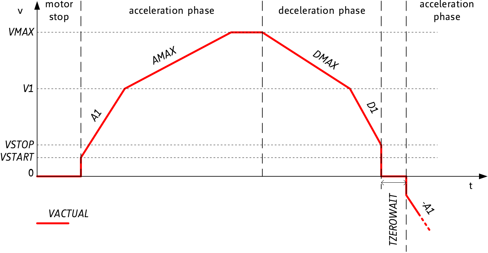

- [About](#orgad89128)
- [Protocol](#org1893526)
- [Background](#org8de352a)
- [Example Usage](#org4578627)
- [Installation](#org842bf6b)
- [Development](#org671fd47)

    <!-- This file is generated automatically from metadata -->
    <!-- File edits may be overwritten! -->


<a id="orgad89128"></a>

# About

```markdown
- Python Package Name: hex_maze_interface
- Description: Python interface to the Voigts lab hex maze.
- Version: 4.3.0
- Python Version: 3.11
- Release Date: 2026-05-06
- Creation Date: 2024-01-14
- License: BSD-3-Clause
- URL: https://github.com/janelia-python/hex_maze_interface_python
- Author: Peter Polidoro
- Email: peter@polidoro.io
- Copyright: 2025 Howard Hughes Medical Institute
- References:
  - https://github.com/janelia-experimental-technology/hex-maze
  - https://github.com/janelia-kicad/prism-pcb
  - https://github.com/janelia-kicad/cluster-pcb
  - https://github.com/janelia-arduino/ClusterController
  - https://github.com/janelia-arduino/TMC51X0
- Dependencies:
  - click
  - python3-nmap
```


<a id="org1893526"></a>

# Protocol

-   protocol-version = 0x06
-   prism-count = 7
-   command = protocol-version command-length command-number command-parameters
-   response = protocol-version response-length command-number response-parameters
-   duration units = ms
-   position units = mm
-   velocity units = mm/s
-   current units = percent
-   stall-threshold -> higher value = lower sensitivity, 0 indifferent value, 1..63 less sensitivity, -1..-64 higher sensitivity
-   home-parameters = travel-limit, max-velocity, run-current, stall-threshold
-   controller-parameters = start-velocity, stop-velocity, first-velocity, max-velocity, first-acceleration, max-acceleration, max-deceleration, first-deceleration
-   double-position = position-0, position-1
-   prism-diagnostics = health-flags, driver-flags, stall-guard-result, current-scale, last-home-travel-mm
-   diagnostic health flags: bit0 communicating, bit1 communication-failure-latched, bit2 reset-latched, bit3 driver-error-latched, bit4 charge-pump-undervoltage-latched, bit5 recovery-attempted-latched, bit6 recovery-failed-latched, bit7 mirror-resync-required
-   diagnostic driver flags: bit0 stallguard, bit1 over-temperature-warning, bit2 over-temperature-shutdown, bit3 short-to-ground-a, bit4 short-to-ground-b, bit5 open-load-a, bit6 open-load-b, bit7 standstill

| command-name                        | command-format       | command-length | command-number | command-parameters             | response-format | response-length | response-parameters    |
|----------------------------------- |-------------------- |-------------- |-------------- |------------------------------ |--------------- |--------------- |---------------------- |
| invalid-command                     |                      |                |                |                                | '<BBB'          | 3               | 0xEE                   |
| read-cluster-address                | '<BBB'               | 3              | 0x01           |                                | '<BBBB'         | 4               | 0x00..0xFF             |
| communicating-cluster               | '<BBB'               | 3              | 0x02           |                                | '<BBBL'         | 7               | 0x12345678             |
| reset-cluster                       | '<BBB'               | 3              | 0x03           |                                | '<BBB'          | 3               |                        |
| beep-cluster                        | '<BBBH'              | 5              | 0x04           | duration                       | '<BBB'          | 3               |                        |
| led-off-cluster                     | '<BBB'               | 3              | 0x05           |                                | '<BBB'          | 3               |                        |
| led-on-cluster                      | '<BBB'               | 3              | 0x06           |                                | '<BBB'          | 3               |                        |
| power-off-cluster                   | '<BBB'               | 3              | 0x07           |                                | '<BBB'          | 3               |                        |
| power-on-cluster                    | '<BBB'               | 3              | 0x08           |                                | '<BBB'          | 3               |                        |
| home-prism                          | '<BBBBHBBb'          | 9              | 0x09           | prism-address, home-parameters | '<BBBB'         | 4               | prism-address          |
| home-cluster                        | '<BBBHBBb'           | 8              | 0x0A           | home-parameters                | '<BBB'          | 3               |                        |
| homed-cluster                       | '<BBB'               | 3              | 0x0B           |                                | '<BBBBBBBBBB'   | 10              | 0..1[prism-count]      |
| write-target-prism                  | '<BBBBH'             | 6              | 0x0C           | prism-address, position        | '<BBBB'         | 4               | prism-address          |
| write-targets-cluster               | '<BBBHHHHHHH'        | 17             | 0x0D           | position[prism-count]          | '<BBB'          | 3               |                        |
| pause-prism                         | '<BBBB'              | 4              | 0x0E           | prism-address                  | '<BBBB'         | 4               | prism-address          |
| pause-cluster                       | '<BBB'               | 3              | 0x0F           |                                | '<BBB'          | 3               |                        |
| resume-prism                        | '<BBBB'              | 4              | 0x10           | prism-address                  | '<BBBB'         | 4               | prism-address          |
| resume-cluster                      | '<BBB'               | 3              | 0x11           |                                | '<BBB'          | 3               |                        |
| read-positions-cluster              | '<BBB'               | 3              | 0x12           |                                | '<BBBhhhhhhh'   | 17              | -1..32767[prism-count] |
| write-run-current-cluster           | '<BBBB'              | 4              | 0x13           | run-current                    | '<BBB'          | 3               |                        |
| read-run-current-cluster            | '<BBB'               | 3              | 0x14           |                                | '<BBBB'         | 4               | run-current            |
| write-controller-parameters-cluster | '<BBBBBBBBBBB'       | 11             | 0x15           | controller-parameters          | '<BBB'          | 3               |                        |
| read-controller-parameters-cluster  | '<BBB'               | 3              | 0x16           |                                | '<BBBBBBBBBBB'  | 11              | controller-parameters  |
| write-double-target-prism           | '<BBBBHH'            | 8              | 0x17           | prism-address, double-position | '<BBBB'         | 4               | prism-address          |
| write-double-targets-cluster        | '<BBBHHHHHHHHHHHHHH' | 31             | 0x18           | double-position[prism-count]   | '<BBB'          | 3               |                        |
| read-home-outcomes-cluster          | '<BBB'               | 3              | 0x19           |                                | '<BBBBBBBBBB'   | 10              | home-outcome[prism-count] |
| read-prism-diagnostics-cluster      | '<BBB'               | 3              | 0x1A           |                                | '<BBB...'       | 52              | prism-diagnostics[prism-count] |
| clear-prism-diagnostics-cluster     | '<BBB'               | 3              | 0x1B           |                                | '<BBB'          | 3               |                        |
| recovery-home-prism                 | '<BBBBHBBb'          | 9              | 0x1C           | prism-address, home-parameters | '<BBBB'         | 4               | prism-address          |
| recovery-home-cluster               | '<BBBHBBb'           | 8              | 0x1D           | home-parameters                | '<BBB'          | 3               |                        |
| confirm-home-prism                  | '<BBBB'              | 4              | 0x1E           | prism-address                  | '<BBBB'         | 4               | prism-address          |
| confirm-home-cluster                | '<BBB'               | 3              | 0x1F           |                                | '<BBB'          | 3               |                        |


<a id="org8de352a"></a>

# Background




<a id="org4578627"></a>

# Example Usage


## Recommended Rig Settings

Validated single-cluster settings for the current rewrite bench and
experimental-rig bring-up:

```python
from hex_maze_interface import ControllerParameters, HomeParameters

recommended_home_parameters = HomeParameters(
    travel_limit=100,
    max_velocity=10,
    run_current=43,
    stall_threshold=0,
)

recovery_home_parameters = HomeParameters(
    travel_limit=550,
    max_velocity=10,
    run_current=40,
    stall_threshold=0,
)

recommended_controller_parameters = ControllerParameters(
    start_velocity=10,
    stop_velocity=10,
    first_velocity=40,
    max_velocity=40,
    first_acceleration=120,
    max_acceleration=80,
    max_deceleration=80,
    first_deceleration=120,
)
```

Notes:

- Earlier GUI settings with `start_velocity = 20` and `stop_velocity = 20`
  were not reliable on the validated bench.
- The historical `stall_threshold = 10` setting was too insensitive for at
  least one prism on the desk rig. `stall_threshold = 5` was also too
  insensitive for another prism after a firmware flash. `stall_threshold = 0`
  is the current provisional setting while `last_home_travel_mm` diagnostics
  are used to distinguish true hardstop homes from possible early stalls.
  Current firmware rejects ordinary-home StallGuard events that are more than
  `2 mm` earlier than the expected travel, so suspicious stalls no longer
  immediately zero the prism.
- Keep commanded positive prism positions clear of the mechanical positive
  hard stop on the real rig.
- Use ordinary repeated `100 mm` homing when a researcher is present at the
  rig. Use recovery homing only for rare fully automated preparation where one
  command must definitely home all prisms.
- The quiet supervised home profile lowers noise by reducing homing velocity
  and current. Bench testing showed StallGuard may still miss the hard-stop
  event at this speed, so this profile relies on bounded travel plus operator
  supervision, not on StallGuard as a required success signal.
- `hardware_home_noise_sweep.py` records relative laptop-microphone `dBFS`
  measurements alongside home outcomes and diagnostics for homing profile
  comparisons.
- If a researcher has visually confirmed all prisms are already on the hard
  stops, `confirm_home_cluster()` marks the cluster homed and zeros driver
  positions without commanding motion.
- Current firmware clamps researcher-settable motion parameters before applying
  them and before reporting controller/current readback:
  ordinary home travel `1..100 mm`, recovery home travel `1..550 mm`, home
  velocity `4..12 mm/s`, home current `35..50%`, StallGuard threshold `-10..0`,
  normal current `40..75%`, normal start/stop velocity `1..10 mm/s`, normal
  first/max velocity up to `40 mm/s`, normal acceleration/deceleration within
  the current `20..120`/`20..80 mm/s/s` profile, and normal targets `0..550 mm`.


## Python

```python
from hex_maze_interface import HexMazeInterface, MazeException, HomeParameters, ControllerParameters
hmi = HexMazeInterface()
cluster_address = 10
hmi.communicating_cluster(cluster_address)
hmi.reset_cluster(cluster_address)
duration_ms = 100
hmi.beep_cluster(cluster_address, duration_ms)
hmi.power_on_cluster(cluster_address)
prism_address = 2
home_parameters = HomeParameters()
home_parameters.travel_limit = 100
home_parameters.max_velocity = 10
home_parameters.run_current = 43
home_parameters.stall_threshold = 0
# a single prism may be homed
hmi.home_prism(cluster_address, prism_address, home_parameters)
# or all prisms in a cluster may be homed at the same time
hmi.home_cluster(cluster_address, home_parameters)
hmi.recovery_home_cluster(cluster_address, recovery_home_parameters)
hmi.confirm_home_cluster(cluster_address)
hmi.homed_cluster(cluster_address)
print(hmi.read_positions_cluster(cluster_address))
# a single prism may be commanded to move immediately
hmi.write_target_prism(cluster_address, prism_address, 100)
print(hmi.read_positions_cluster(cluster_address))
hmi.pause_cluster(cluster_address)
# or all prisms in a cluster may be commanded to move
hmi.write_targets_cluster(cluster_address, (10, 20, 30, 40, 50, 60, 70))
# but the prisms only move after resuming while pausing
hmi.resume_cluster(cluster_address)
print(hmi.read_positions_cluster(cluster_address))
print(hmi.read_run_current_cluster(cluster_address))
hmi.write_run_current_cluster(cluster_address, 75)
print(hmi.read_run_current_cluster(cluster_address))
print(hmi.read_controller_parameters_cluster(cluster_address))
controller_parameters = ControllerParameters()
controller_parameters.start_velocity = 10
controller_parameters.stop_velocity = 10
controller_parameters.first_velocity = 40
controller_parameters.max_velocity = 40
controller_parameters.first_acceleration = 120
controller_parameters.max_acceleration = 80
controller_parameters.max_deceleration = 80
controller_parameters.first_deceleration = 120
hmi.write_controller_parameters_cluster(cluster_address, controller_parameters)
print(hmi.read_controller_parameters_cluster(cluster_address))
hmi.write_target_prism(cluster_address, prism_address, 100)
hmi.write_double_target_prism(cluster_address, prism_address, (50, 150))
hmi.write_double_targets_cluster(cluster_address, ((10,20),(30,40),(50,60),(70,80),(90,100),(110,120),(130,140)))
diagnostics = hmi.read_prism_diagnostics_cluster(cluster_address)
hmi.clear_prism_diagnostics_cluster(cluster_address)
hmi.power_off_cluster(cluster_address)
```


## Command Line


### Help

```sh
maze --help
# Usage: maze [OPTIONS] COMMAND [ARGS]...

#   Command line interface to the Voigts lab hex maze.

Options:
  --help  Show this message and exit.

Commands:
  beep-all-clusters
  beep-cluster
  communicating-all-clusters
  communicating-cluster
  confirm-home-all-clusters
  confirm-home-cluster
  confirm-home-prism
  home-all-clusters
  home-cluster
  home-prism
  homed-cluster
  led-off-all-clusters
  led-off-cluster
  led-on-all-clusters
  led-on-cluster
  pause-all-clusters
  pause-cluster
  pause-prism
  power-off-all-clusters
  power-off-cluster
  power-on-all-clusters
  power-on-cluster
  read-controller-parameters-cluster
  read-positions-cluster
  read-run-current-cluster
  recovery-home-all-clusters
  recovery-home-cluster
  recovery-home-prism
  reset-all-clusters
  reset-cluster
  resume-all-clusters
  resume-cluster
  resume-prism
  write-controller-parameters-all-clusters
  write-controller-parameters-cluster
  write-double-target-prism
  write-run-current-all-clusters
  write-run-current-cluster
  write-target-prism
  write-targets-cluster
```


### Example

```sh
CLUSTER_ADDRESS=10
maze communicating-cluster $CLUSTER_ADDRESS
maze reset-cluster $CLUSTER_ADDRESS
DURATION_MS=100
maze beep-cluster $CLUSTER_ADDRESS $DURATION_MS
maze power-on-cluster $CLUSTER_ADDRESS
PRISM_ADDRESS=2
TRAVEL_LIMIT=100
MAX_VELOCITY=10
RUN_CURRENT=43
STALL_THRESHOLD=0
# a single prism may be homed
maze home-prism $CLUSTER_ADDRESS $PRISM_ADDRESS $TRAVEL_LIMIT $MAX_VELOCITY $RUN_CURRENT $STALL_THRESHOLD
# or all prisms in a cluster may be homed at the same time
maze home-cluster $CLUSTER_ADDRESS $TRAVEL_LIMIT $MAX_VELOCITY $RUN_CURRENT $STALL_THRESHOLD
maze recovery-home-cluster $CLUSTER_ADDRESS 550 10 40 0
maze confirm-home-cluster $CLUSTER_ADDRESS
maze homed-cluster $CLUSTER_ADDRESS
maze read-positions-cluster $CLUSTER_ADDRESS
# a single prism may be commanded to move immediately
maze write-target-prism $CLUSTER_ADDRESS $PRISM_ADDRESS 100
maze read-positions-cluster $CLUSTER_ADDRESS
maze pause-cluster $CLUSTER_ADDRESS
# or all prisms in a cluster may be commanded to move
maze write-targets-cluster $CLUSTER_ADDRESS 10 20 30 40 50 60 70
# but the prisms only move after resuming while pausing
maze resume-cluster $CLUSTER_ADDRESS
maze read-positions-cluster $CLUSTER_ADDRESS
maze read-run-current-cluster $CLUSTER_ADDRESS
maze write-run-current-cluster $CLUSTER_ADDRESS 75
maze read-run-current-cluster $CLUSTER_ADDRESS
START_VELOCITY=10
STOP_VELOCITY=10
FIRST_VELOCITY=40
MAX_VELOCITY=40
FIRST_ACCELERATION=120
MAX_ACCELERATION=80
MAX_DECELERATION=80
FIRST_DECELERATION=120
maze write-controller-parameters-cluster $CLUSTER_ADDRESS \
$START_VELOCITY $STOP_VELOCITY $FIRST_VELOCITY $MAX_VELOCITY $FIRST_ACCELERATION \
$MAX_ACCELERATION $MAX_DECELERATION $FIRST_DECELERATION
maze write-target-prism $CLUSTER_ADDRESS $PRISM_ADDRESS 100
maze write-double-target-prism $CLUSTER_ADDRESS $PRISM_ADDRESS 50 150
maze power-off-cluster $CLUSTER_ADDRESS
```


<a id="org842bf6b"></a>

# Installation

<https://github.com/janelia-python/python_setup>


## GNU/Linux


### Ethernet

C-x C-f /sudo::/etc/network/interfaces

```sh
auto eth1

iface eth1 inet static

    address 192.168.10.2

    netmask 255.255.255.0

    gateway 192.168.10.1

    dns-nameserver 8.8.8.8 8.8.4.4
```

```sh
nmap -sn 192.168.10.0/24
nmap -p 7777 192.168.10.3
nmap -sV -p 80,7777 192.168.10.0/24
```

```sh
sudo -E guix shell nmap
sudo -E guix shell wireshark -- wireshark
```

```sh
make guix-container
```


### Serial

1.  Drivers

    GNU/Linux computers usually have all of the necessary drivers already installed, but users need the appropriate permissions to open the device and communicate with it.
    
    Udev is the GNU/Linux subsystem that detects when things are plugged into your computer.
    
    Udev may be used to detect when a device is plugged into the computer and automatically give permission to open that device.
    
    If you plug a sensor into your computer and attempt to open it and get an error such as: "FATAL: cannot open /dev/ttyACM0: Permission denied", then you need to install udev rules to give permission to open that device.
    
    Udev rules may be downloaded as a file and placed in the appropriate directory using these instructions:
    
    [99-platformio-udev.rules](https://docs.platformio.org/en/stable/core/installation/udev-rules.html)

2.  Download rules into the correct directory

    ```sh
    curl -fsSL https://raw.githubusercontent.com/platformio/platformio-core/master/scripts/99-platformio-udev.rules | sudo tee /etc/udev/rules.d/99-platformio-udev.rules
    ```

3.  Restart udev management tool

    ```sh
    sudo service udev restart
    ```

4.  Ubuntu/Debian users may need to add own “username” to the “dialout” group

    ```sh
    sudo usermod -a -G dialout $USER
    sudo usermod -a -G plugdev $USER
    ```

5.  After setting up rules and groups

    You will need to log out and log back in again (or reboot) for the user group changes to take effect.
    
    After this file is installed, physically unplug and reconnect your board.


## Python Code

The Python code in this library may be installed in any number of ways, chose one.

1.  pip

    ```sh
    python3 -m venv ~/venvs/hex_maze_interface
    source ~/venvs/hex_maze_interface/bin/activate
    pip install hex_maze_interface
    ```

2.  guix

    Setup guix-janelia channel:
    
    <https://github.com/guix-janelia/guix-janelia>
    
    ```sh
    guix install python-hex-maze-interface
    ```


## Windows


### Python Code

The Python code in this library may be installed in any number of ways, chose one.

1.  pip

    ```sh
    python3 -m venv C:\venvs\hex_maze_interface
    C:\venvs\hex_maze_interface\Scripts\activate
    pip install hex_maze_interface
    ```


<a id="org671fd47"></a>

# Development


## Clone Repository

```sh
git clone git@github.com:janelia-python/hex_maze_interface_python.git
cd hex_maze_interface_python
```


## Guix


### Install Guix

[Install Guix](https://guix.gnu.org/manual/en/html_node/Binary-Installation.html)


### Edit metadata.org

```sh
make -f .metadata/Makefile metadata-edits
```


### Tangle metadata.org

```sh
make -f .metadata/Makefile metadata
```


### Develop Python package

```sh
make -f .metadata/Makefile guix-dev-container
exit
```


### Test Python package using ipython shell

```sh
make -f .metadata/Makefile guix-dev-container-ipython
import hex_maze_interface
exit
```


### Test Python package installation

```sh
make -f .metadata/Makefile guix-container
exit
```


### Upload Python package to pypi

```sh
make -f .metadata/Makefile upload
```


### Test direct device interaction using serial terminal

```sh
make -f .metadata/Makefile guix-dev-container-port-serial # PORT=/dev/ttyACM0
# make -f .metadata/Makefile PORT=/dev/ttyACM1 guix-dev-container-port-serial
? # help
[C-a][C-x] # to exit
```


## Docker


### Install Docker Engine

<https://docs.docker.com/engine/>


### Develop Python package

```sh
make -f .metadata/Makefile docker-dev-container
exit
```


### Test Python package using ipython shell

```sh
make -f .metadata/Makefile docker-dev-container-ipython
import hex_maze_interface
exit
```


### Test Python package installation

```sh
make -f .metadata/Makefile docker-container
exit
```
